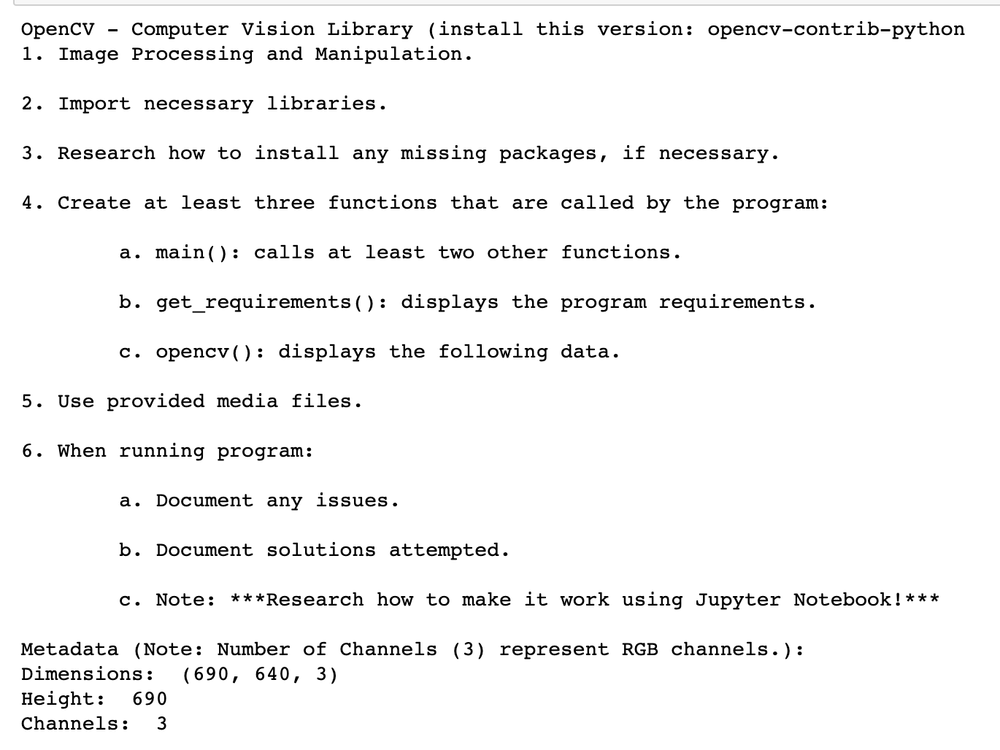
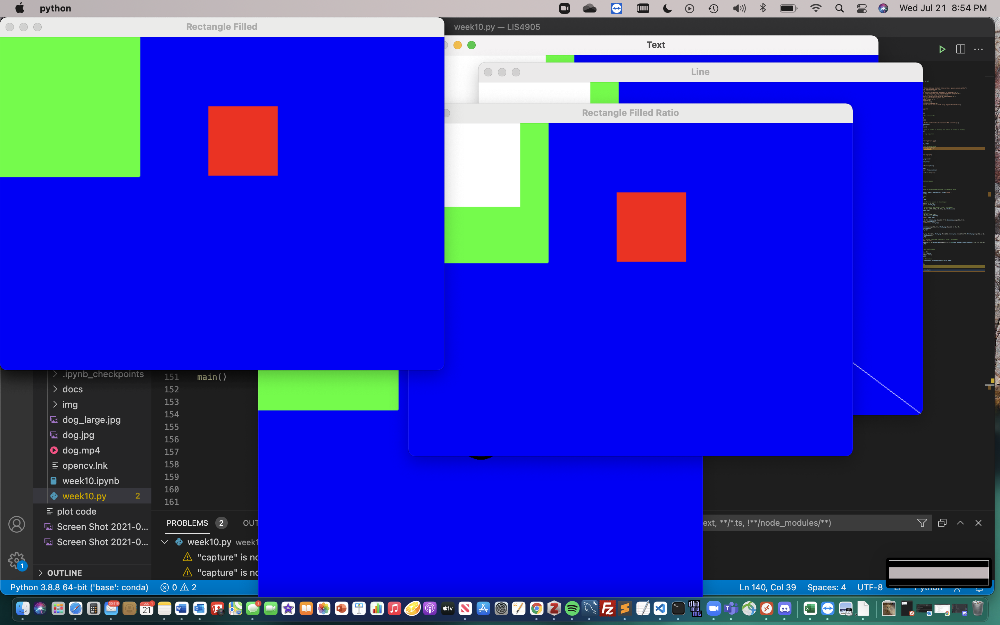

*Welcome to Rachel's Week 10 ReadMe.md*

>

# LIS4905 Enterprise Application Solutions (DIS)

## Rachel Hester

### Week 10 Requirements:

*Deliverables:*

1. *Backward-engineer screenshot below:* README.md file should include the following items:
    1. *Screenshot of your Jupyter notebook (see below);*
    2. Upload .ipynb file and create link in README.md;
        *NOTE:* Before uploading .ipynb file, be sure to do the following actions from *Kernal* menu:
            a. *Restart & Clear Output*
            b. *Restart & Run All*
    *Note: Always* run the .py files before trying t ocreate a Jupyter notebook using the code from the .py files. If the .py files won't run, neither will the notebook!

> 
> 
> 

#### Assignment Screenshots:

1. Screenshot of Jupyter Notebook Part 1                                   
 

2. Screenshot of Jupyter Notebook Part 2

3. Screenshot of Jupyter Notebook Part 3

*Links to Notebook and Python File Below:*

1. Link to Python File
[Python File](docs/week10.py "Week 10 Python File")

2. Link to Notebook
[Notebook](docs/week10.ipynb "Week 10 Notebook")