*Welcome to Rachel's Week 11 ReadMe.md*

>

# LIS4905 Enterprise Application Solutions (DIS)

## Rachel Hester

### Week 11 Requirements:

*Deliverables:*

- Create a Python program based upon the following requirements:

    - Use all four intrinsic Python Data Structures: List, Tuple, Set, Dictionary.
        Randomly assign grades of "S" or "U" (satisfactory or unsatisfactory) to each DIS member--of course, not including your ever-kind, ever-caring, ever-compassionate instructor. ;)
        Display code and results to your Bitbucket repo.
        Backward-engineer screenshot below: README.md file should include the following items:

        Screenshot of your Jupyter notebook (see below);
        Upload .ipynb file and create link in README.md;
        - Note: Before uploading .ipynb file, be sure to do the following actions from Kernal menu:
            - a. Restart & Clear Output
            - Restart & Run All
        - Note: Always run the .py files before trying to create a Jupyter notebook using the code from the .py files. If the .py files won't run, neither will the notebook!

> 
> 
> 

#### Assignment Screenshots:

1. Screenshot of Jupyter Notebook Part 1                                   
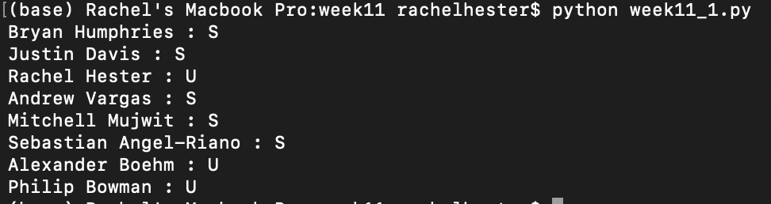 

2. Screenshot of Jupyter Notebook Part 1
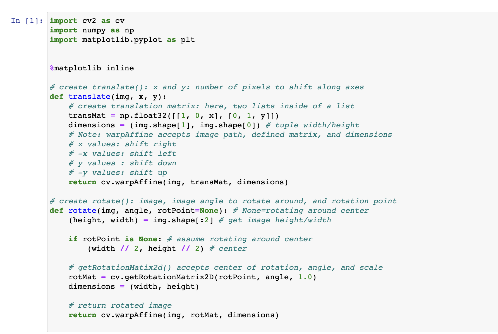
         
3. Screenshot of Jupyter Notebook Part 2
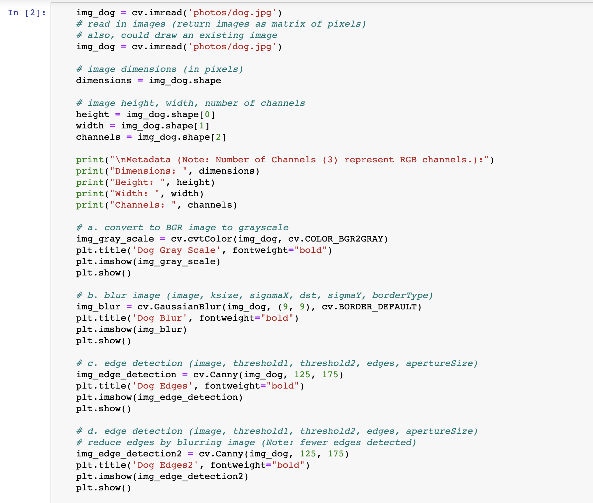

3. Screenshot of Jupyter Notebook Part 3
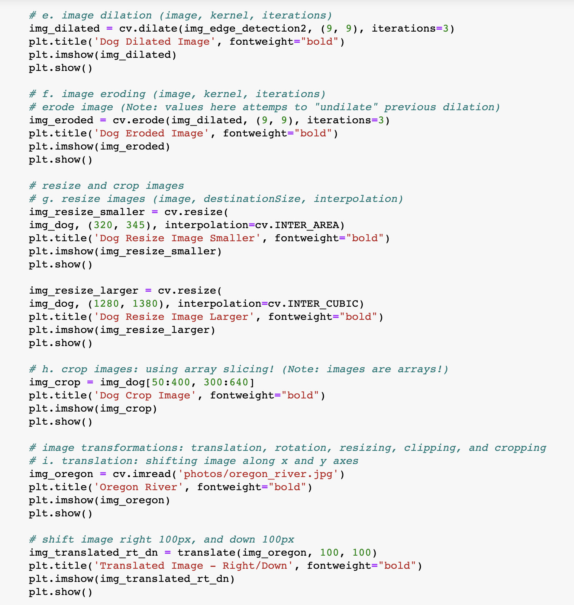

3. Screenshot of Jupyter Notebook Part 4
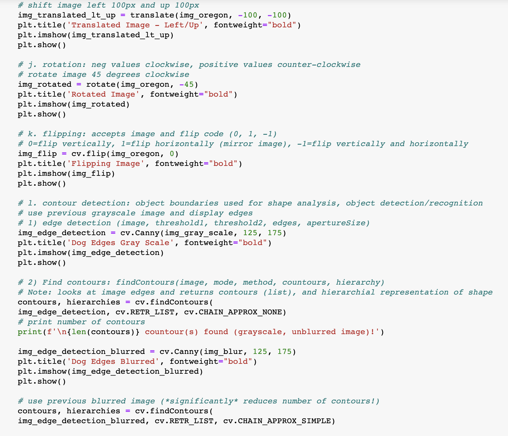

3. Screenshot of Jupyter Notebook Part 5
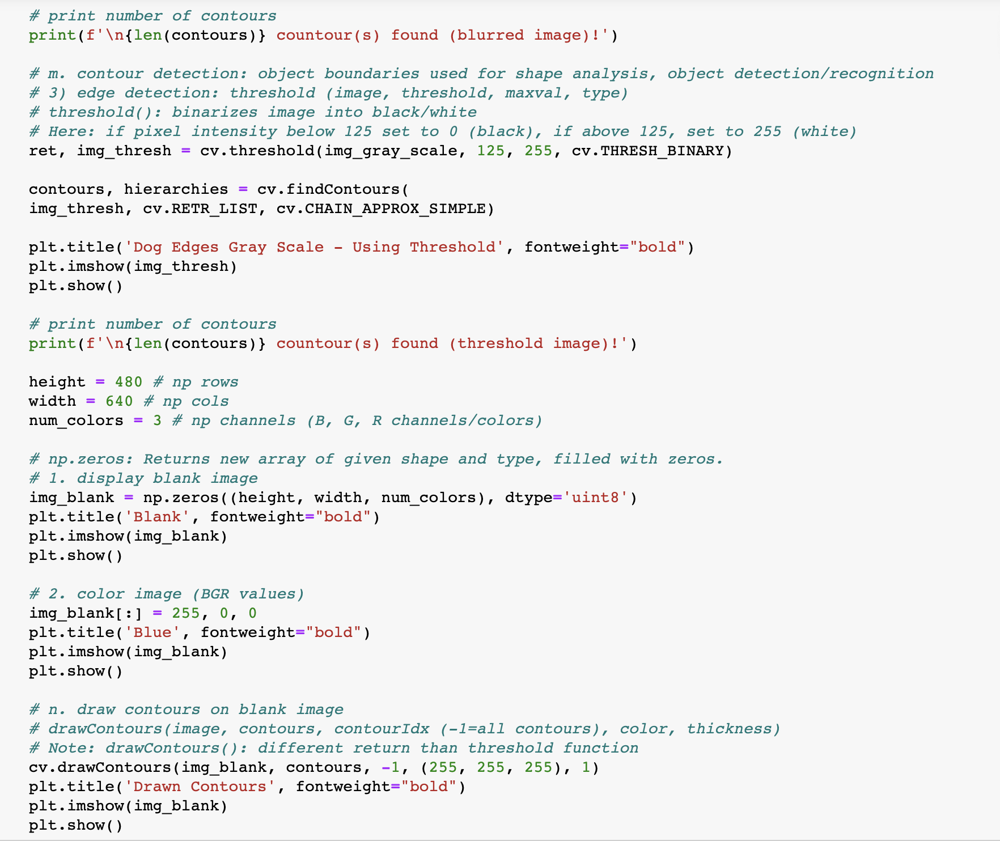

3. Screenshot of Jupyter Notebook Part 6
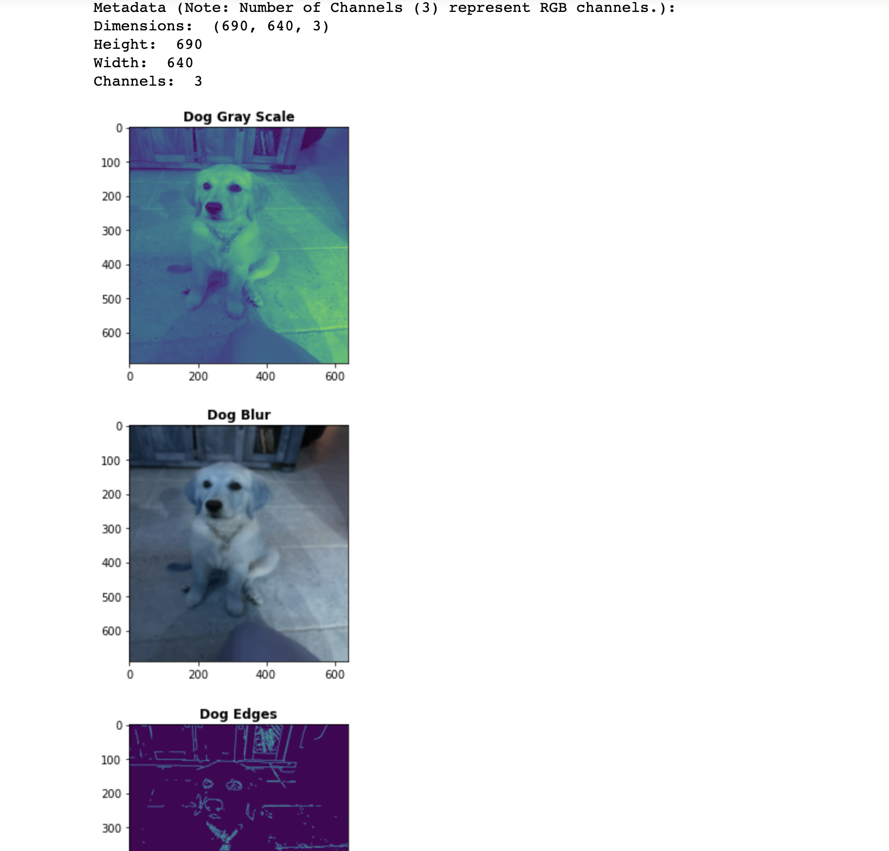

3. Screenshot of Jupyter Notebook Part 7
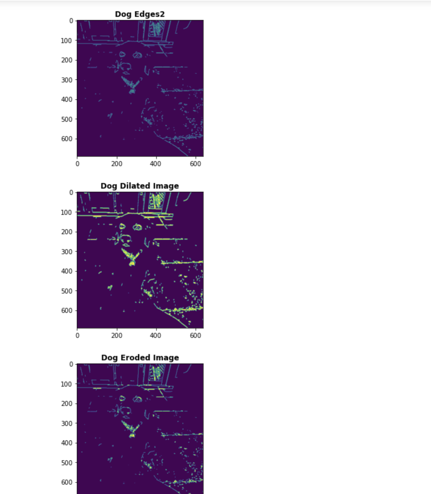

3. Screenshot of Jupyter Notebook Part 8
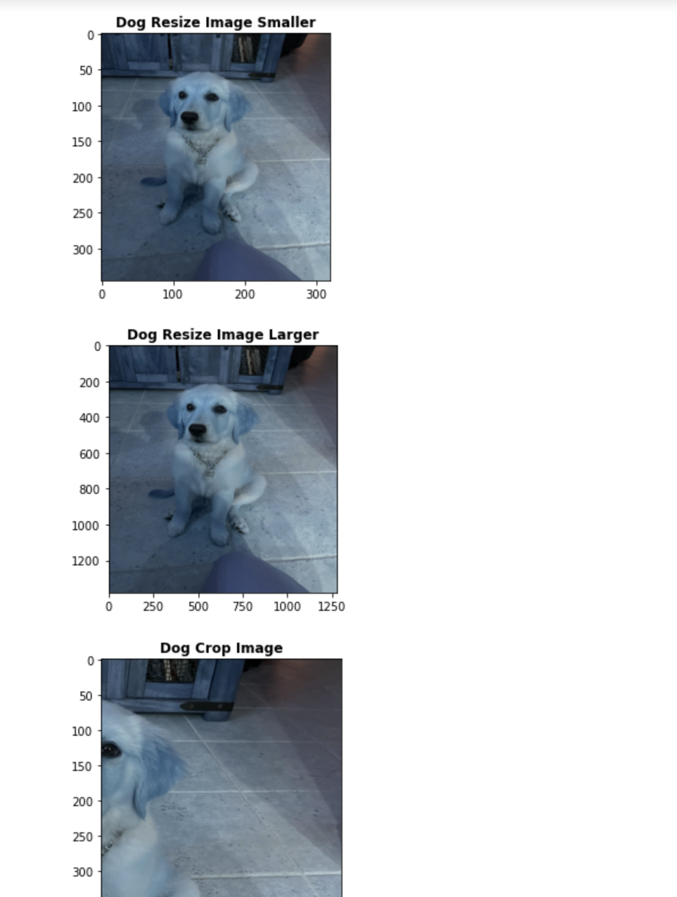

3. Screenshot of Jupyter Notebook Part 9
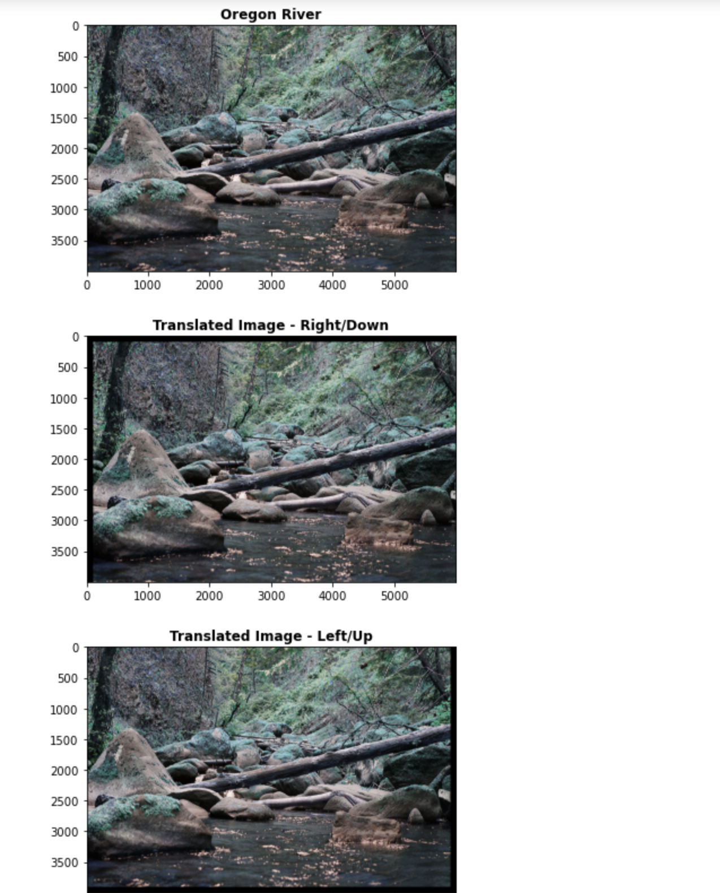

3. Screenshot of Jupyter Notebook Part 10
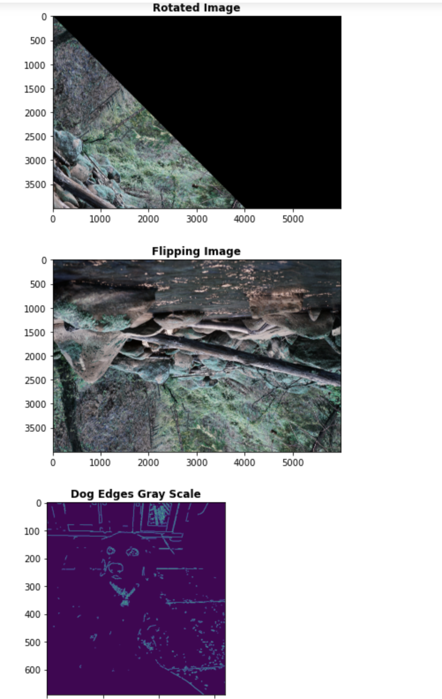

3. Screenshot of Jupyter Notebook Part 11
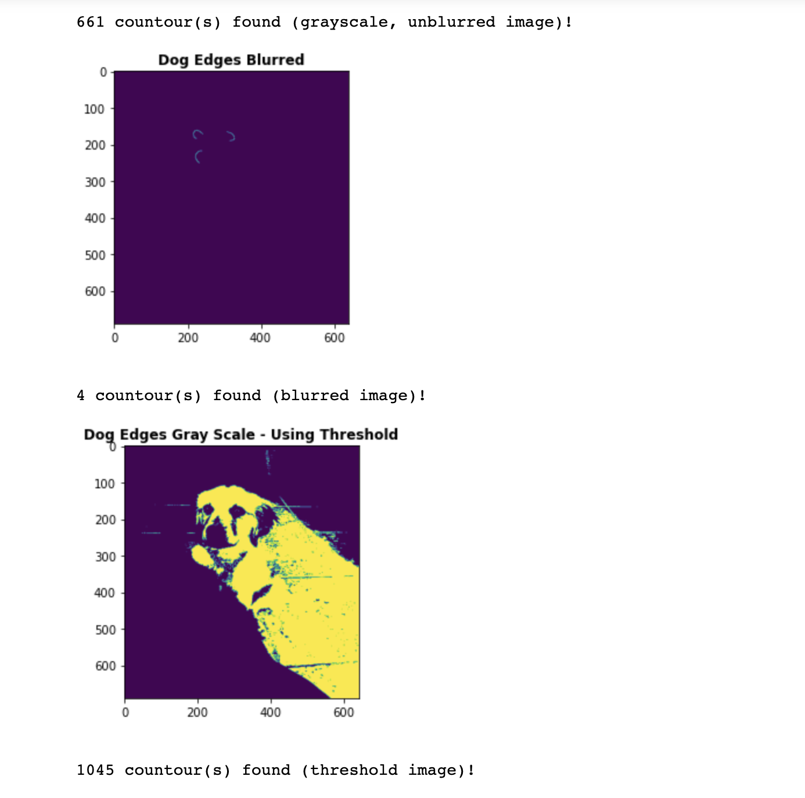

3. Screenshot of Jupyter Notebook Part 12
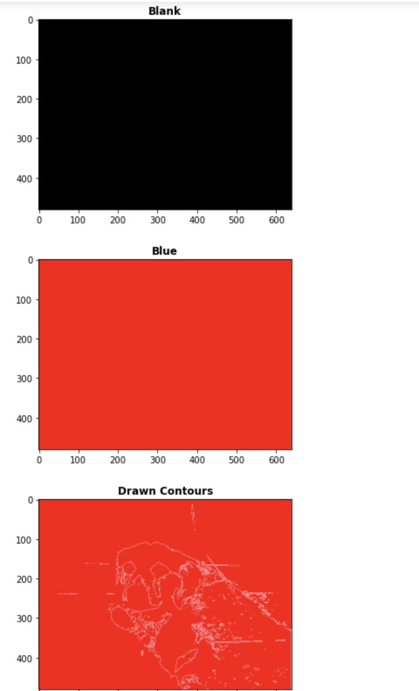

*Links to Notebook and Python File Below:*

1. Link to Python File
[Python File](docs/week11_2.py "Week 11 Python 1 File")

1. Link to Python File
[Python File](docs/week11_2.py "Week 11 Python 2 File")

2. Link to Notebook
[Notebook](docs/week11.ipynb "Week 11 Notebook")