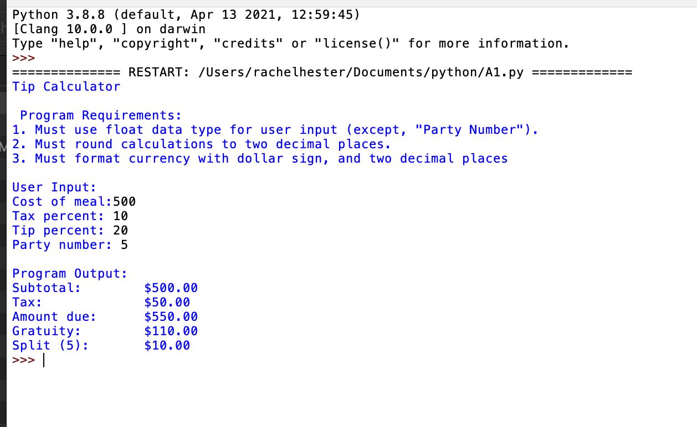
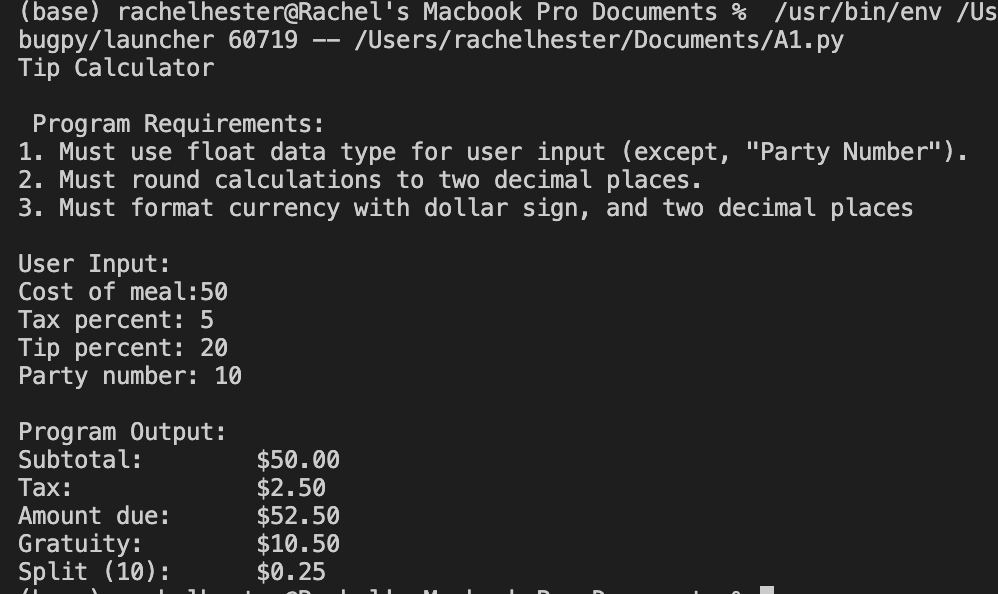

*Welcome to Rachel's Week 2 ReadMe.MD*

>

# LIS4905 Enterprise Application Solutions (DIS)

## Rachel Hester

### Week 2 Requirements:

*Deliverables:*

1. Team Work: One File
2. Distributed Version Control (only if Git not installed)
3. Development Installations
4. Test Installation

> 
> 
> 

#### Assignment Screenshots:

1. Screenshot of IDLE                                  
 

2. Screenshot of VSCode

*Links to Notebook and Python File Below:*

1. Link to Python File
[Python File](docs/A1.py "Week 2")

2. Link to Notebook
[Notebook](docs/A1.ipynb "Week 2 Notebook")