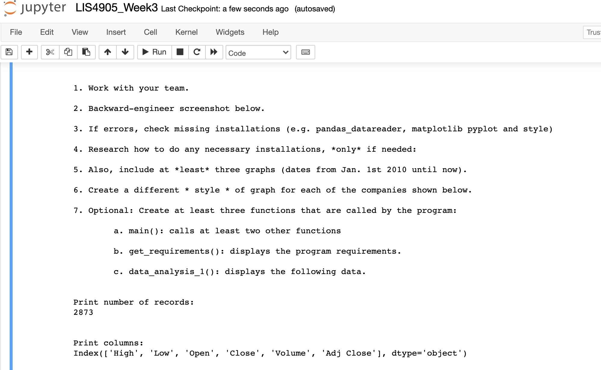
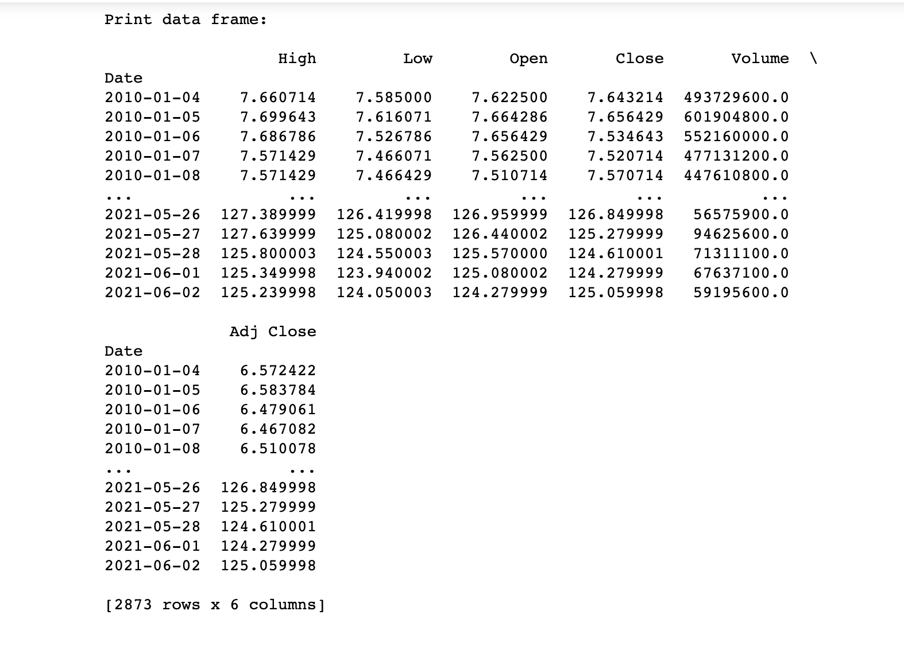
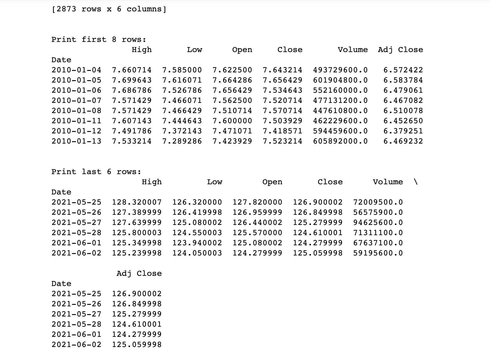
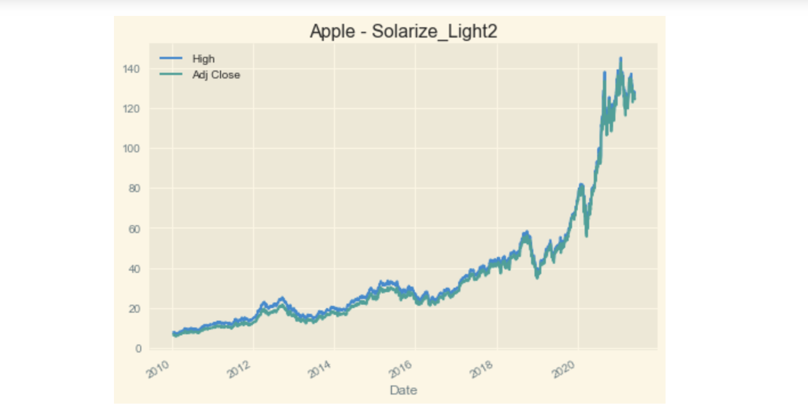
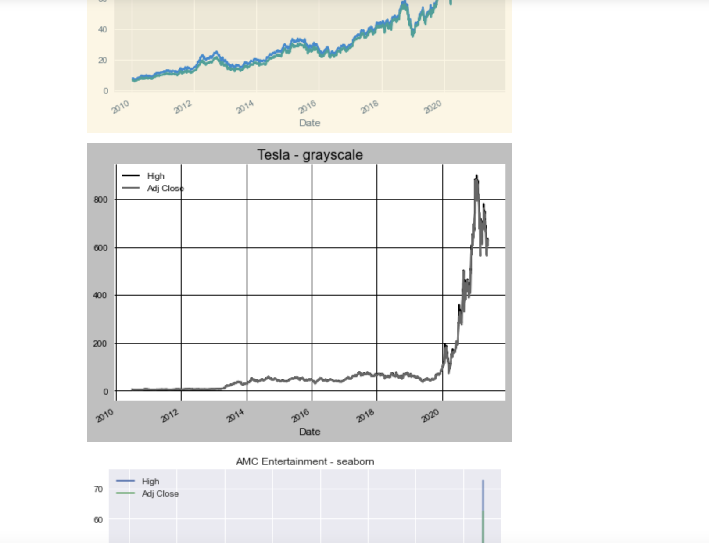
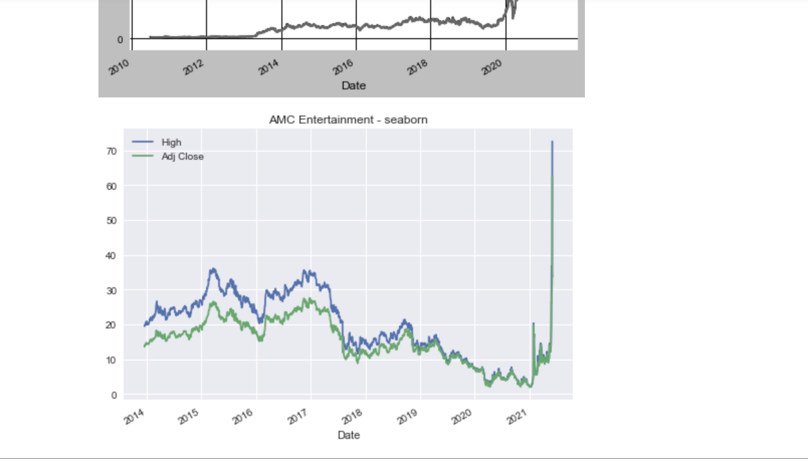

*Welcome to Rachel's Week 3 ReadMe.md*

>

# LIS4905 Enterprise Application Solutions (DIS)

## Rachel Hester

### Week 3 Requirements:

*Deliverables:*

1. Chs. 6-10 in Python textbook.
2. Backward-engineer screenshot below: README.md file should include the following items:
    1. Screenshot of your Jupyter notebook (see below);
    2. Upload .ipynb file and create link in README.md;
    Note: Before uploading .ipynb file, be sure to do the following actions from Kernal menu:
        a. Restart & Clear Output
        b. Restart & Run All

> 
> 
> 

#### Assignment Screenshots:

1. Screenshot of Jupyter Notebook Part 1                                   
 

2. Screenshot of Jupyter Notebook Part 2

3. Screenshot of Jupyter Notebook Part 3

4. Screenshot of Jupyter Notebook Part 4

5. Screenshot of Jupyter Notebook Part 5

6. Screenshot of Jupyter Notebook Part 6

*Links to Notebook and Python File Below:*

1. Link to Python File
[Python File](docs/LIS4905_Week3.py "Week 3")

2. Link to Notebook
[Notebook](docs/LIS4905_Week3.ipynb "Week 3 Notebook")