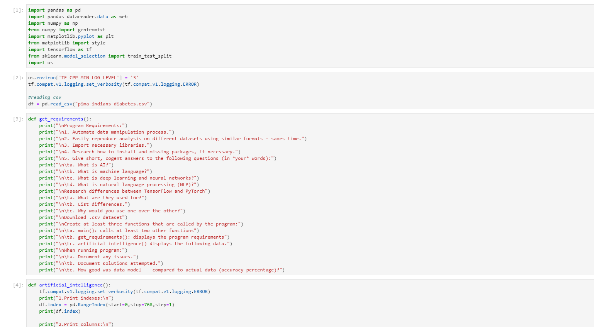
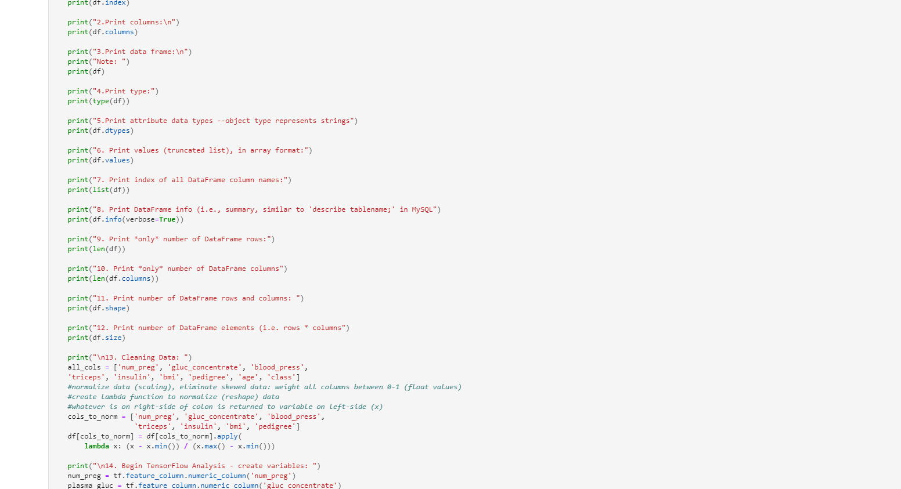
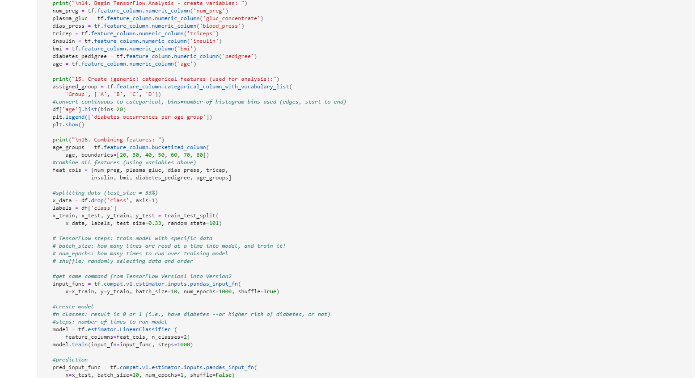
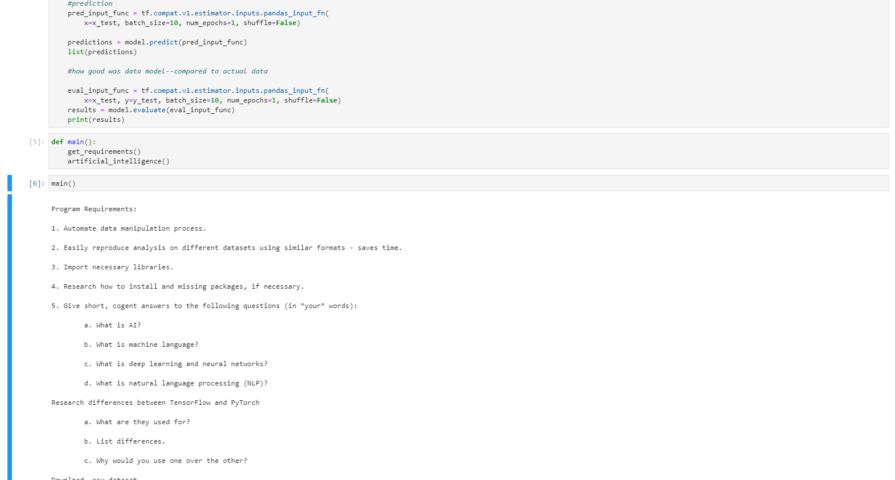
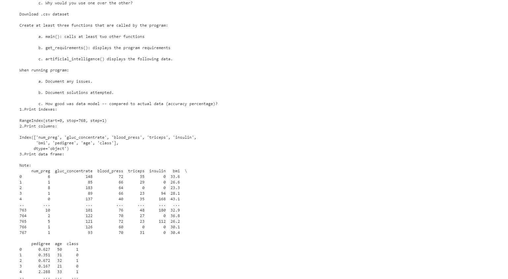
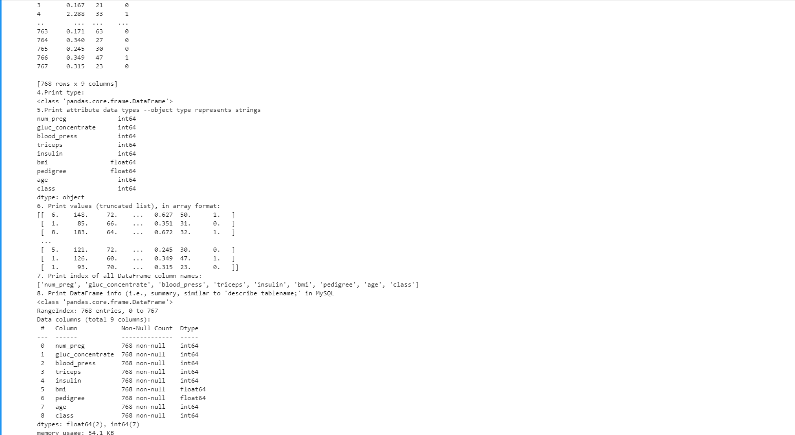
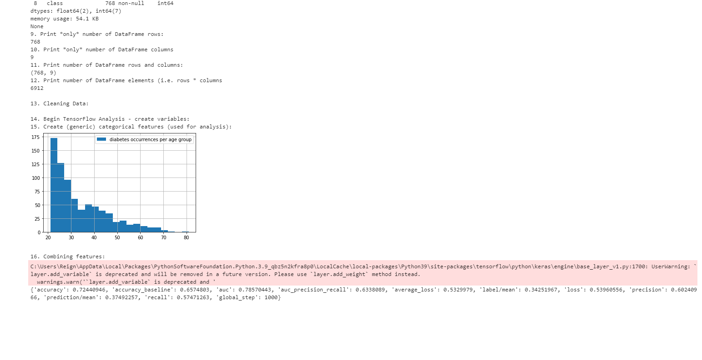

*Welcome to Rachel's Week 5 ReadMe.md*

>

# LIS4905 Enterprise Application Solutions (DIS)

## Rachel Hester

### Week 5 Requirements:

*Deliverables:*

1. Chs. 16-18 in Python textbook.
2. Backward-engineer screenshot below: README.md file should include the 
   following items:
	1. Screenshot of your Jupyter notebook (see below);
	2. Upload .ipynb file and create link in README.md; NOTE: Before uploading .ipynb file, be sure to do the following actions from Kernal menu: a. Restart & Clear Output b. Restart & Run All Note: Always run the .py files before trying t ocreate a Jupyter notebook using the code from the .py files. If the .py files won't run, neither will the notebook!
3. Questions from Week 5
	1. What is AI? 
	> AI (Artificial Intelligence) is intelligence demonstrated by machines, rather than natural intelligence which is displayed by humans and animals.
	2. What is Machine Language?
	> Machine Language is a language understood by a computer - all programs and programming languages are eventually generated into or run machine language which is primarily made up of instructions and data in binary.
	3. What is deep learning and neural networks?
	> Neural networks attempt to copy the way the human brain functions through the use of algorithms. The "deep" in deep learning focuses on the many layers in a neural network. A neural network that has more than 3 layers is considered a deep learning algorithm.
	4. What is natural language processing? (NLP)
	> Natural language is the way that humans communicate with each other through mainly speech and text. Natural language processing focuses on the "automatic manipulation" of language (speech and text) processing by software. 
	5. What are TensorFlow and PyTorch used for?
	> TensorFlow and PyTorch are both popular deep learning frameworks. TensorFlow was developed by Google and released in 2015 whereas PyTorch was developed by Facebook and released in 2016. 
	6. How are TensorFlow and PyTorch different? (List differences)
	> PyTorch was based on the torch Library whereas TensorFlow was based on Theano, which is a Python library.
	> PyTorch works on a dynamic graph concept whereas TensorFlow works on a static graph concept.
	> PyTorch has fewer features to work with but is more "user-friendly" whereas TensorFlow has a higher level of functionality but can be comparatively, more difficult to learn. 
	7. Why would you use one over the other?
	> PyTorch is easier to work with and might be better for quickly built projects and building prototypes quickly whereas TensorFlow might be used for production models because its abilities are meant for production-ready projects. 

>
> 
> 
> 

#### Assignment Screenshots:

1. Screenshot of Jupyter Notebook Part 1                                   
 

2. Screenshot of Jupyter Notebook Part 2

3. Screenshot of Jupyter Notebook Part 3

4. Screenshot of Jupyter Notebook Part 4

5. Screenshot of Jupyter Notebook Part 5

6. Screenshot of Jupyter Notebook Part 6

7. Screenshot of Jupyter Notebook Part 7

*Links to Notebook and Python File Below:*

1. Link to Python File
[Python File](docs/week5.py "Week 5 Python File")

2. Link to Notebook
[Notebook](docs/Week5.ipynb "Week 5 Notebook")