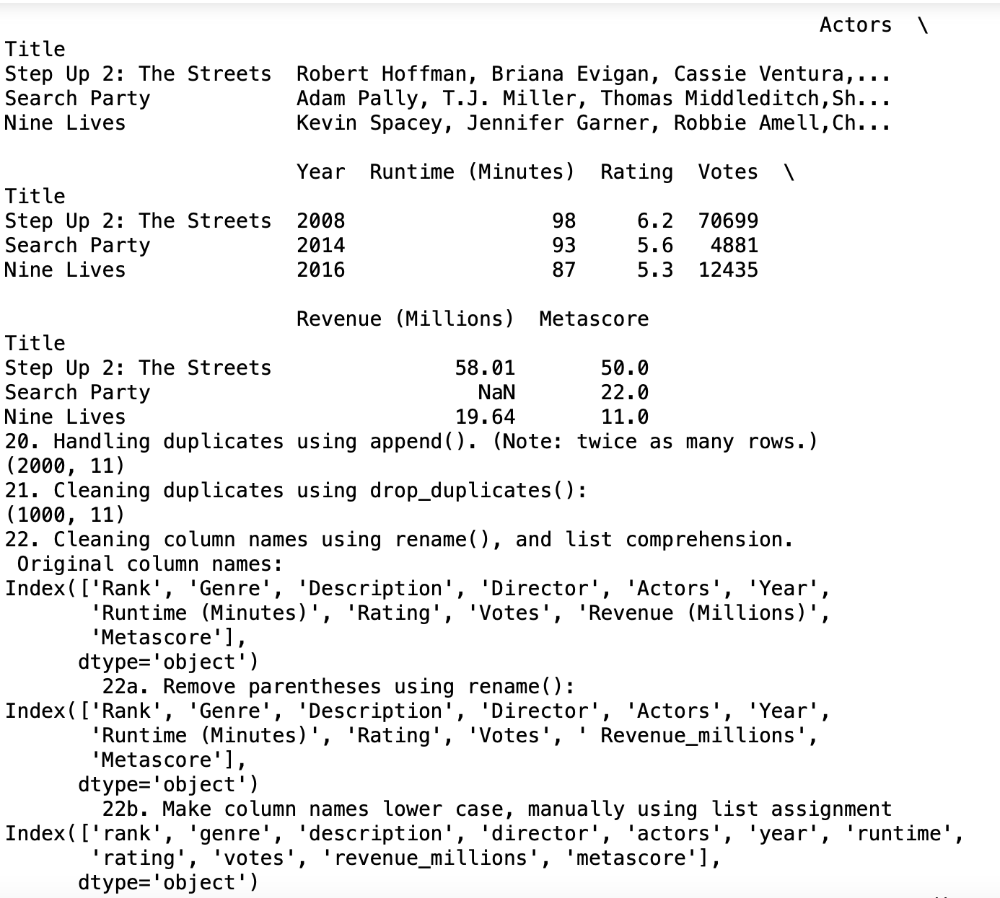

*Welcome to Rachel's Week 8 ReadMe.md*

>

# LIS4905 Enterprise Application Solutions (DIS)

## Rachel Hester

### Week 8 Requirements:

*Deliverables:*

1. *Backward-engineer screenshot below:* README.md file should include the following items:
    1. *Screenshot of your Jupyter notebook (see below);*
    2. Upload .ipynb file and create link in README.md;
        *NOTE:* Before uploading .ipynb file, be sure to do the following actions from *Kernal* menu:
            a. *Restart & Clear Output*
            b. *Restart & Run All*
    *Note: Always* run the .py files before trying t ocreate a Jupyter notebook using the code from the .py files. If the .py files won't run, neither will the notebook!

> 
> 
> 

#### Assignment Screenshots:

1. Screenshot of Jupyter Notebook Part 1                                   
 

2. Screenshot of Jupyter Notebook Part 2

3. Screenshot of Jupyter Notebook Part 3

4. Screenshot of Jupyter Notebook Part 4

5. Screenshot of Jupyter Notebook Part 5

6. Screenshot of Jupyter Notebook Part 6

7. Screenshot of Jupyter Notebook Part 7

8. Screenshot of Jupyter Notebook Part 8

9. Screenshot of Jupyter Notebook Part 9

10. Screenshot of Jupyter Notebook Part 10

11. Screenshot of Jupyter Notebook Part 11

12. Screenshot of Jupyter Notebook Part 12

13. Screenshot of Jupyter Notebook Part 13

14. Screenshot of Jupyter Notebook Part 14

15. Screenshot of Jupyter Notebook Part 15

16. Screenshot of Jupyter Notebook Part 16

*Links to Notebook and Python File Below:*

1. Link to Python File
[Python File](docs/week8.py "Week 8 Python File")

2. Link to Notebook
[Notebook](docs/week8.ipynb "Week 8 Notebook")